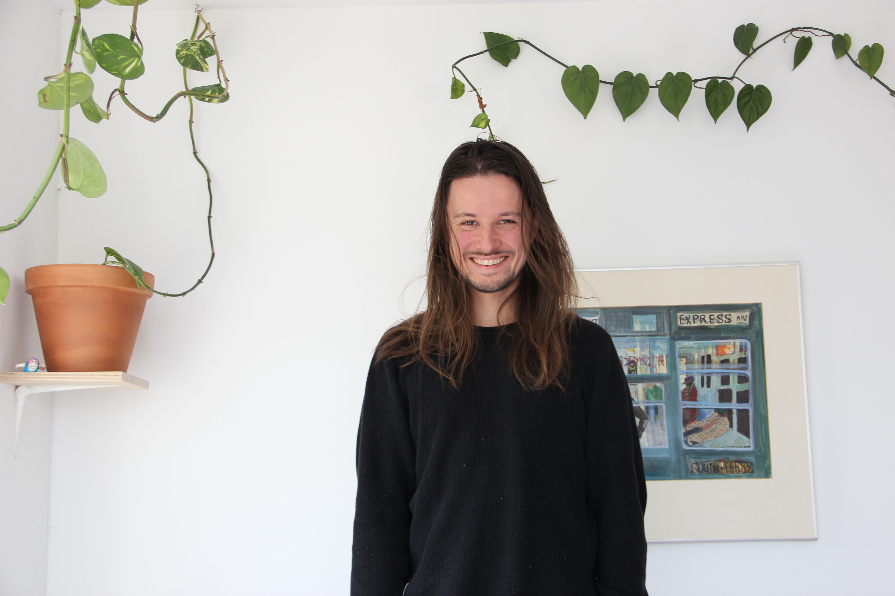

I am Luuk Schipperheijn, a Rotterdam-based creative developer with a broad range of experience encompassing
front-end, back-end, and various programming languages and
frameworks. Comfortable working on diverse project types, from
mobile and web applications to desktop solutions, prototypes and
production environments. Experienced in both solo and team
settings, with a particular focus on contributing to the design
process.

Check out my <a href="./resume-luuk-schipperheijn.pdf" download>resume</a> to find out about specific skills and experience. You can reach me at [luuk@luuk.computer](mailto:luuk@luuk.computer)

Links:
- [LinkedIn](https://www.linkedin.com/in/luuk-schipperheijn-92805a30/)
- [GitHub](https://github.com/luukschipperheyn/)
- [SoundCloud](https://soundcloud.com/klontklont)

