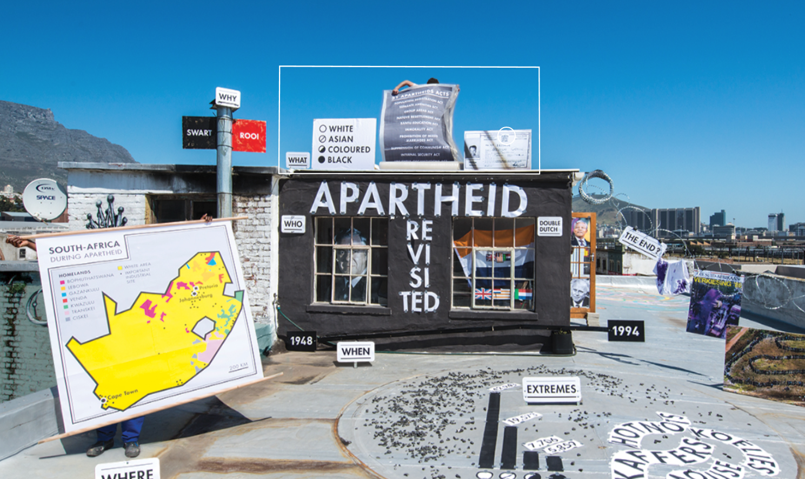
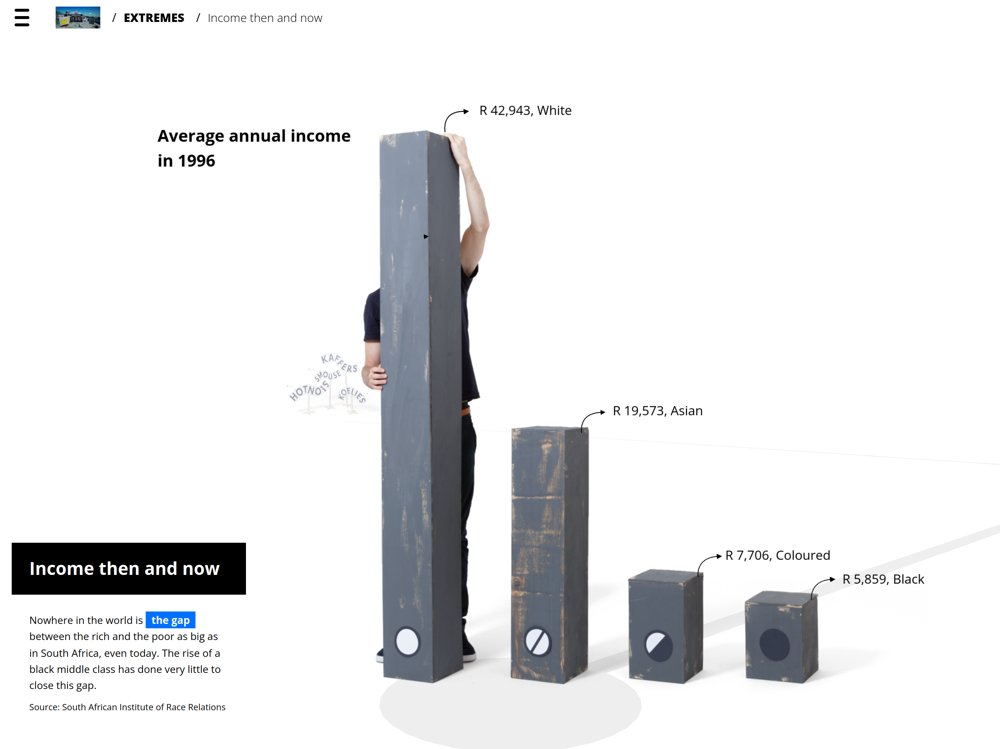

Apartheid Revisited offers a unique exploration of apartheid history through an interactive information landscape designed by Ruiter Janssen. This project bridges the gap between historical facts and personal reflection, inviting users to navigate through a digital realm that applies a human scale to the narrative.

Partnering with Ruiter Janssen, Afdeling Buitengewone Zaken embarked on a collaborative journey to transform his traditional paper-based work into a dynamic digital experience. Through an iterative process, we combined lo-fi sketches with technical experimentation to shape the design and implementation concurrently.

My contribution involved developing a tool to seamlessly integrate 3D models from Blender into our ThreeJS environment, facilitating efficient collaboration and rapid prototyping. Leveraging JavaScript, VueJS, and ThreeJS technologies, we breathed life into Ruiter's vision, offering users a thought-provoking journey through history and contemporary relevance.
