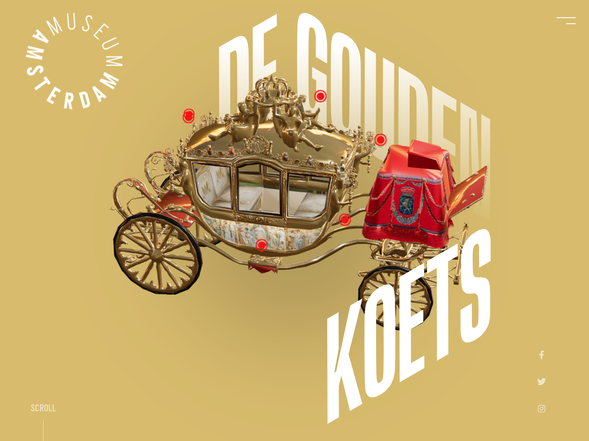
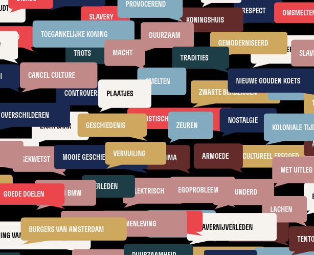

[Goudenkoets.nl](http://goudenkoets.nl/), a collaborative effort with [Ruben Den Brok](https://www.rubendenbrokwebdeveloper.com/) and [Afdeling Buitengewone Zaken](https://www.afdelingbuitengewonezaken.nl), is a web platform addressing public sentiments on the Gouden Koets, a symbol of Dutch history. The site integrates results gathered from a traveling research installation, such as video responses, questions and remarks.

Results from the research installation are presented on the following pages:
- [Opinions (video)](https://goudenkoets.nl/meningen)
- [Advice (audio)](https://goudenkoets.nl/adviezen)
- [Knowledge (questions)](https://goudenkoets.nl/kennis)
