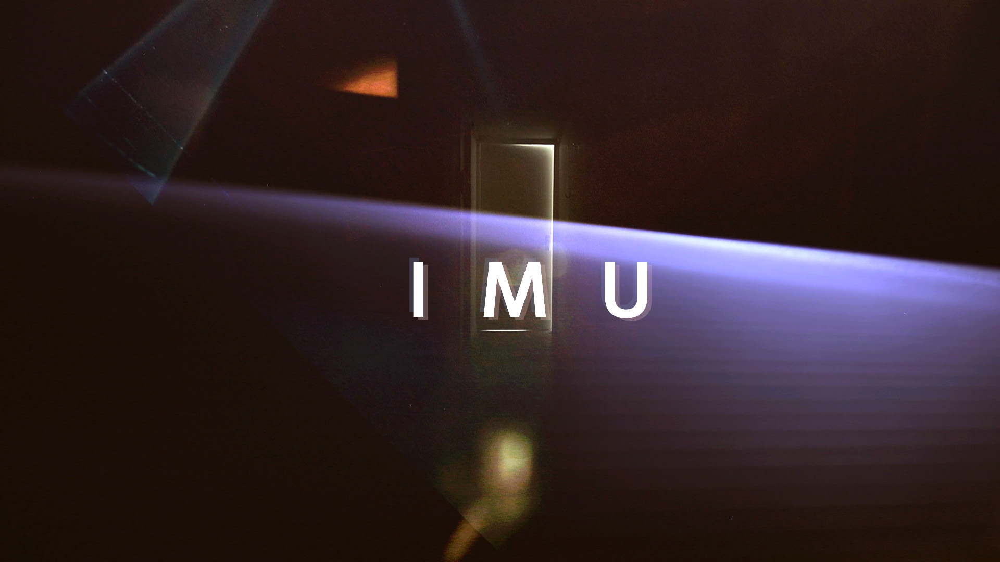
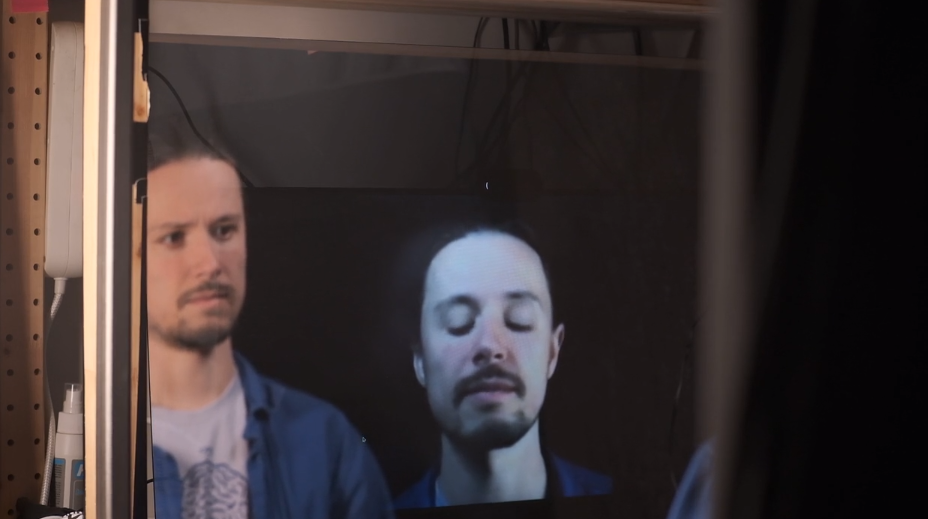
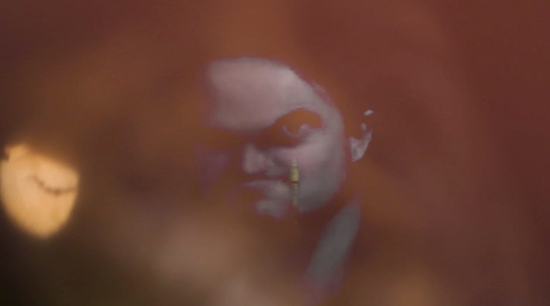

I M U is an interactive film installation in which we manipulate the viewer’s image through deepfake.

The viewer is invited to enter a booth, where they see a film. Through different means, the viewer's self image becomes the main character. The mirror image of the viewer is superimposed over the film by way of a semi-transparent mirror and a light. At some point, a live-generated deepfake of the viewer gets mixed in with the pre-rendered film, at which point, the viewer loses agency over their own image.

Here's a password-protected [trailer video](https://vimeo.com/910411587) of the project. If I emailed you a link to this portfolio, you will find the password in that email.
