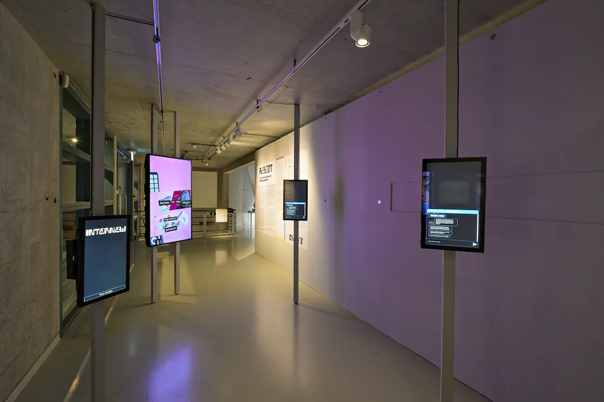
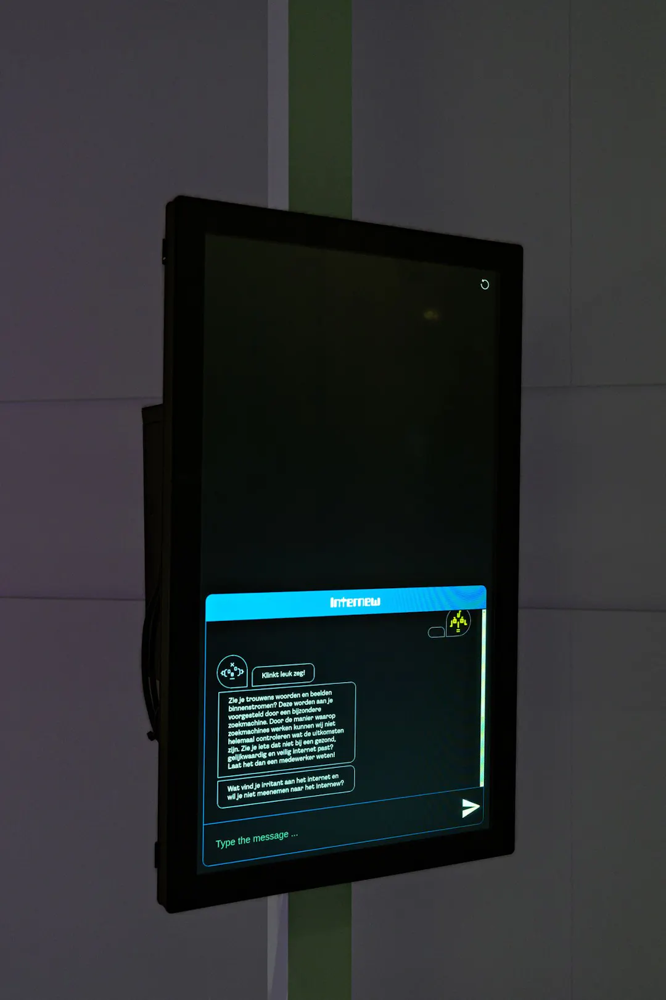

*© Pieter Kers*

The Internew installation, featured at the REBOOT exhibition in the New Institute, serves as an immersive platform for visitors to engage with digital art. Our goal was to create a stimulating “maakplek,” offering visitors a space to collectively express their views on the present and future of the internet.

**Hier komt nog een filmpje wat duidelijk maakt hoe het werkt**

Participants interact with a touch screen. Powered by a chat bot, the installation prompts users to share their perspectives on the internet. Participants are encouraged to reflect on their preferences and concerns, shaping their vision for the internet's evolution.

*© Pieter Kers*

Through user input, screens generate related words and images, fostering collaboration and creativity. This iterative process enables participants to construct collage-like compositions, visually representing their future internet ideals.
