## "What would you delete? What would you save?"

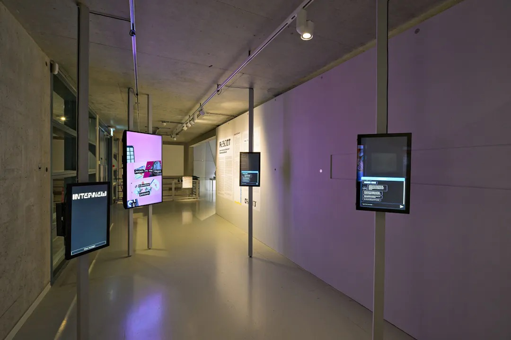
*The Internew installation view. Photo: Pieter Kers*

The Internew installation, featured at the REBOOT exhibition in the New Institute, serves as an immersive platform for visitors to engage with the exhibition's artworks from early nineties internet artists. The visitors are asked two questions that makes up the material for their design of The Internew. They were asked: What would you save from today's internet? What would you delete? Our goal was to create a stimulating “maakplek,” offering visitors a space to collectively express their views on the present and future of the internet. Participants interact with a touch screen. Powered by a chat bot, the installation prompts users to share their perspectives on the internet. Participants are encouraged to reflect on their preferences and concerns, shaping their vision for the internet's evolution.

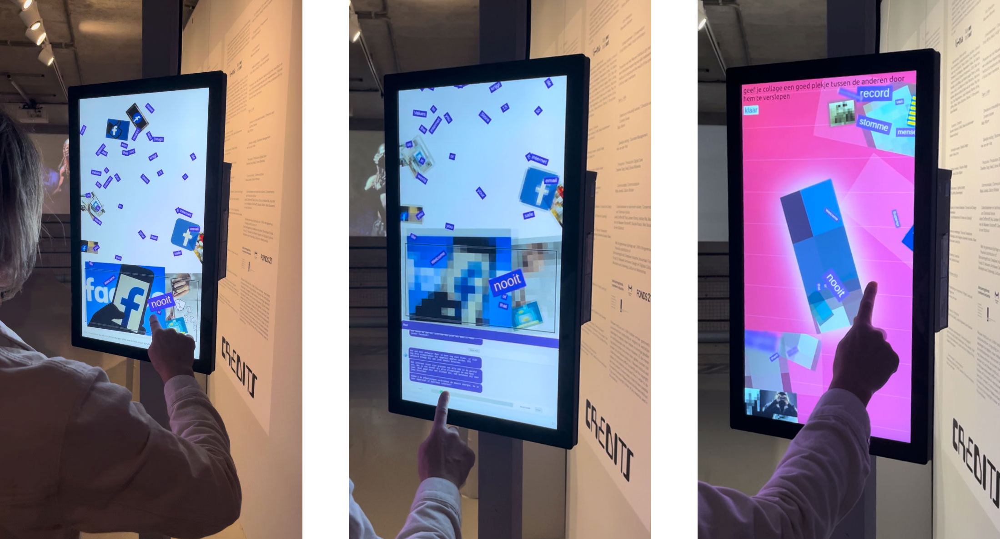
*A special search engine loads images and texts based on answers to the chatbot. Values are represented through slider interaction. Photos: mot*

Through user input, screens generate related words and images, fostering collaboration and creativity. This iterative process enables participants to construct collage-like compositions, visually representing their future internet ideals. Find a selection of anonymous creations below.

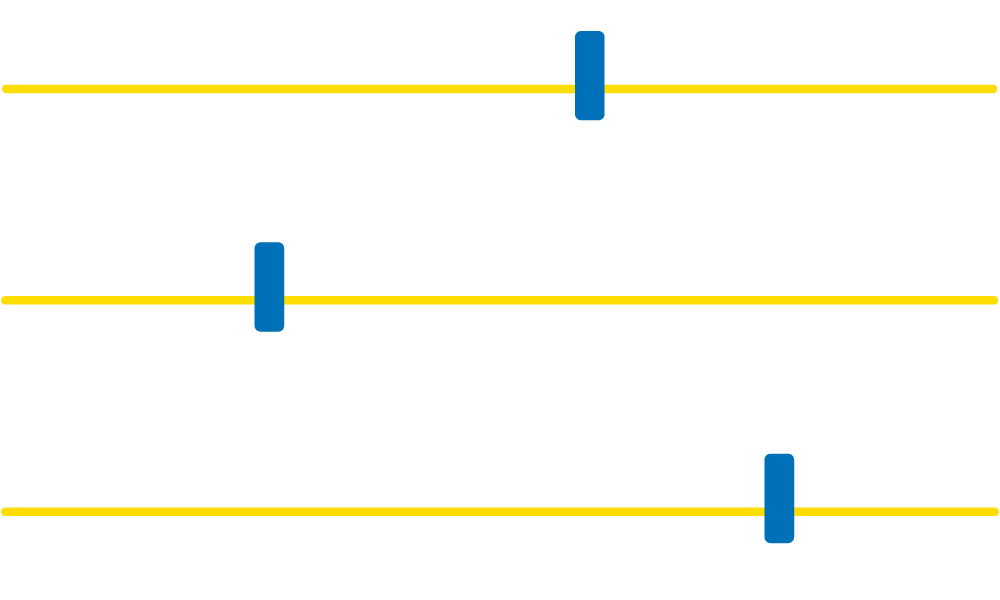
*3 dilemma's are presented to the user. Each dilemma represents a value that influences the design. The user can have free internet, but not without advertisements. Photos: mot*

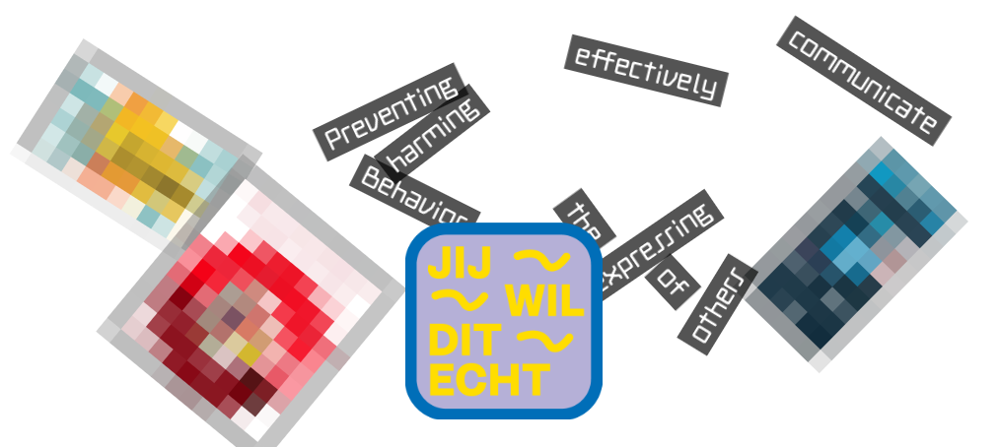
*The Internew by anonymous visitors. mot*

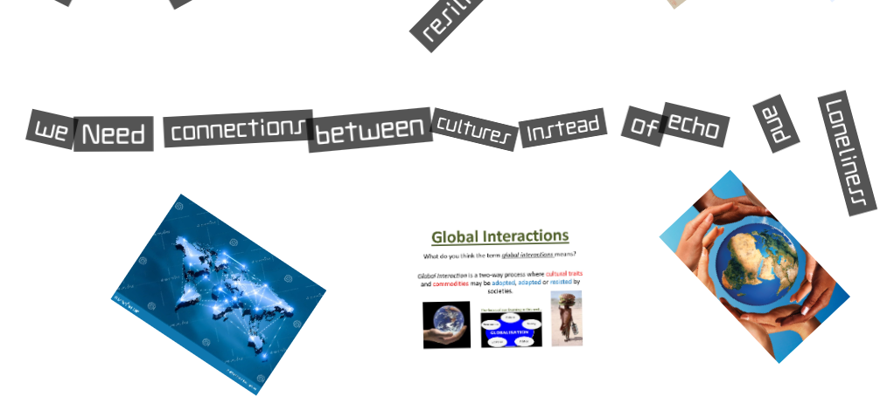

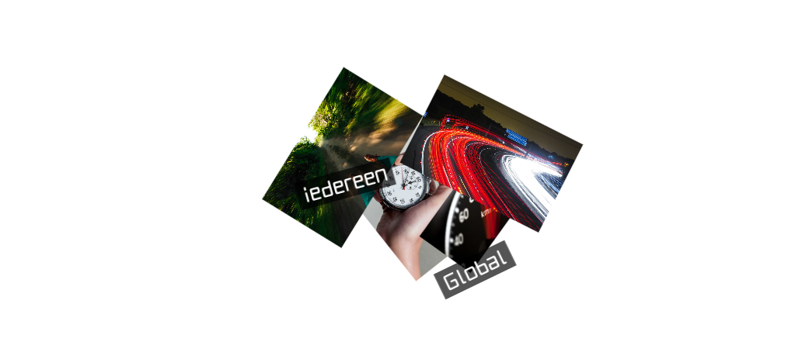

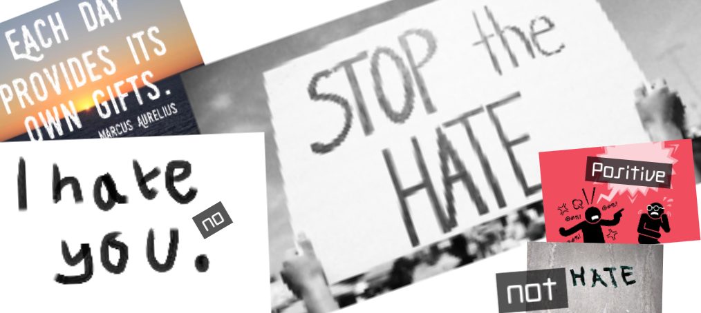

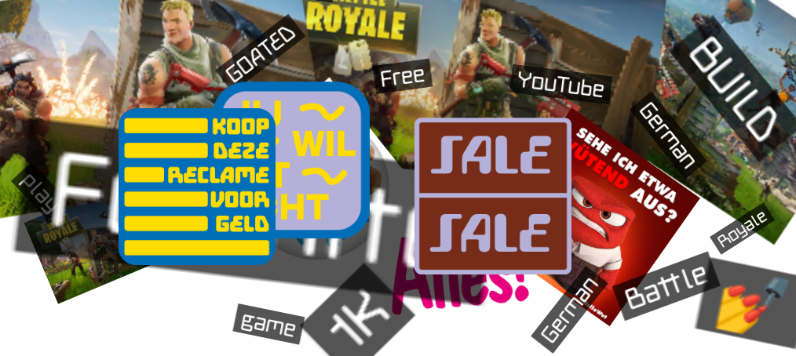

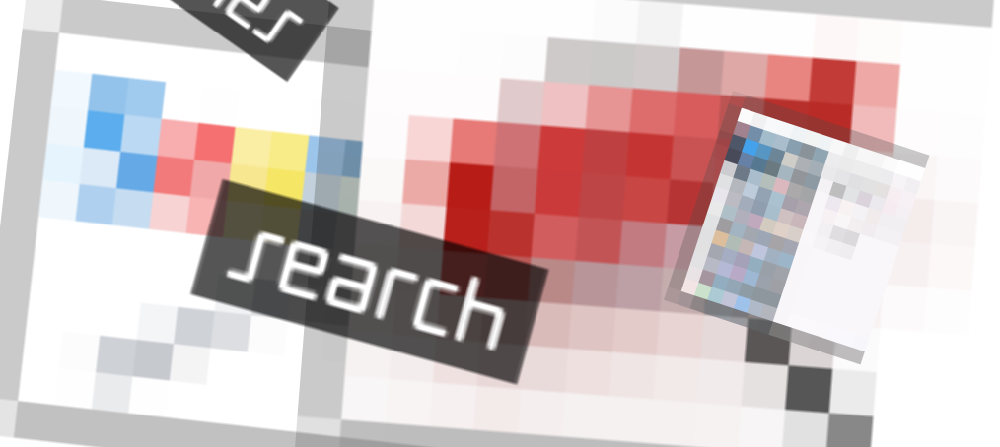

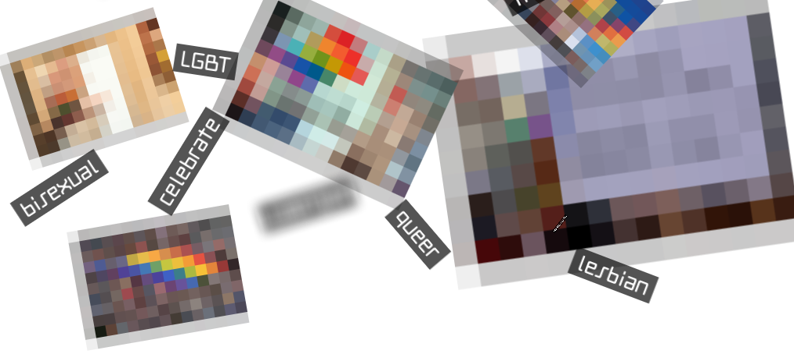

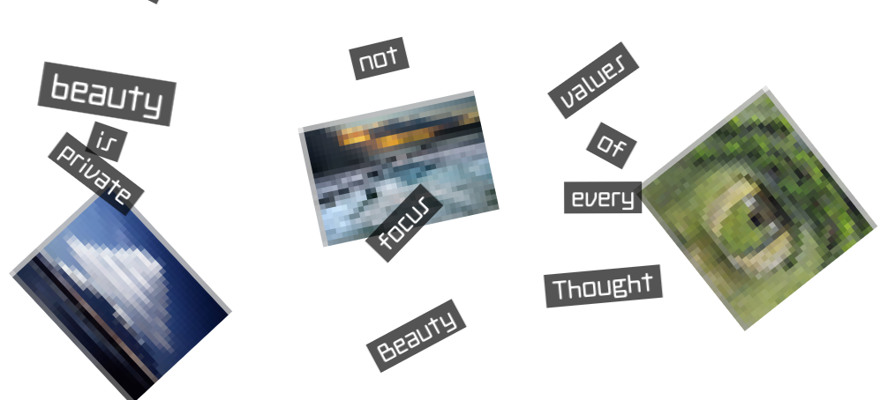

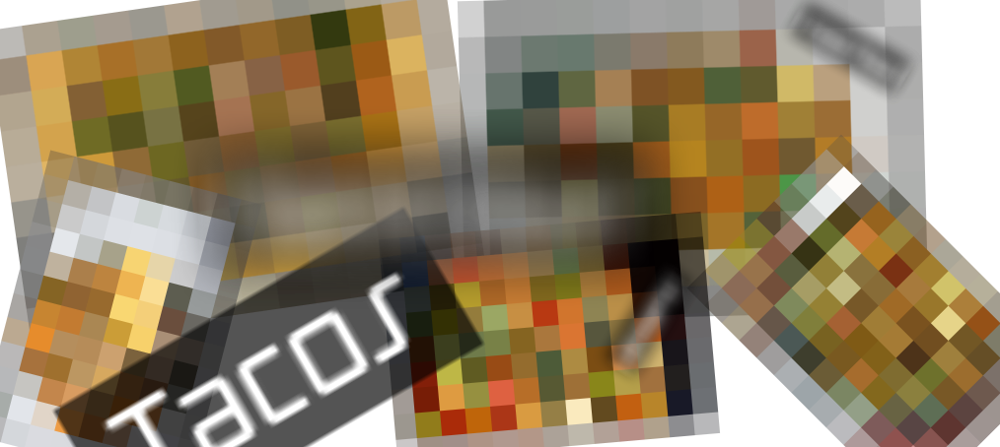

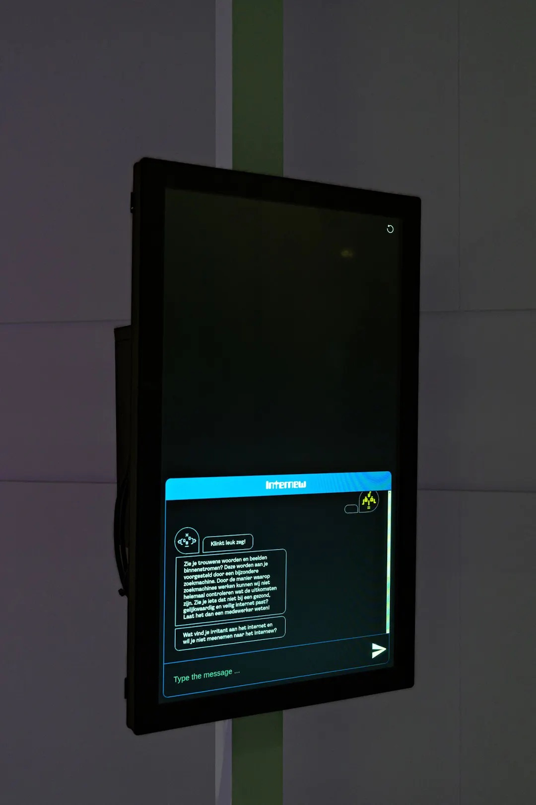
*Chatbot view. Photo: Pieter Kers*
