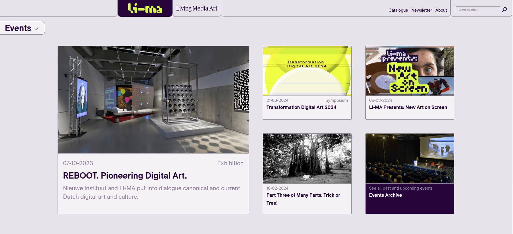

LI-MA is a platform for digital art focusing on conservation, distribution and research. Together with Florian van Zandwijk I created their new [website](https://li-ma.nl). By implementing a straightforward modular system, we ensured that even the most complex and varied content could be easily accessed and explored. Leveraging Gatsby's SSR and image optimization, the site delivers a seamless browsing experience, ensuring rapid load times and intuitive navigation.

Prior to making the main website, we created a platform for LI-MA to host online events. It's a simple page where media and a livestream are integrated in a playful manner. See below for a demonstration of how they used it for their event Unfold or visit the event page for [Cultural Matter](https://culturalmatter.li-ma.nl/projects/amaliaulman).

<video src="./unfold-1.mov" autoplay muted loop playsinline preload="metadata"> </video>
