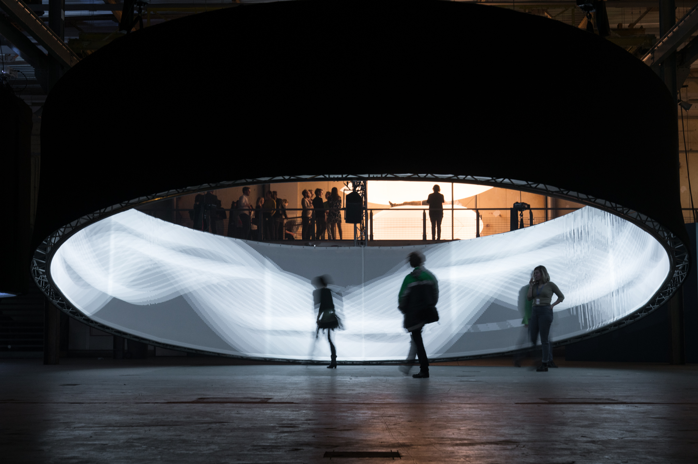

MGNT is an interactive audio-visual installation paying hommage to the pioneers of electronic music. Spanning 10 metres, it is a giant version of a tape loop that visitors can interacts with, using their bodies and the environment through movement and sound.

<iframe src="https://player.vimeo.com/video/223058564?title=0&amp;byline=0&amp;portrait=0&amp;color=000000&amp;muted=1&amp;autoplay=1&amp;autopause=0&amp;loop=1&amp;background=1&amp;app_id=122963" width="1920" height="1080" frameborder="0" title="MGNT@STRP" allow="autoplay" allowfullscreen="" data-ready="true" class="video_embed" id="video_402"></iframe>

MGNT was awarded the first prize in the [ACT awards](https://www.emerce.nl/wire/eindhovense-ode-philipspionier-wint-eerste-strp-act) and was exhibited on the [2017 STRP Biennial](https://strp.nl/events/biennial-2017-senses-sensors)

As part of the core team, I contributed to the concept, management and the development of sensing software and prototypes.

Technology used:

- Processing
- Kinect
- Resolume
