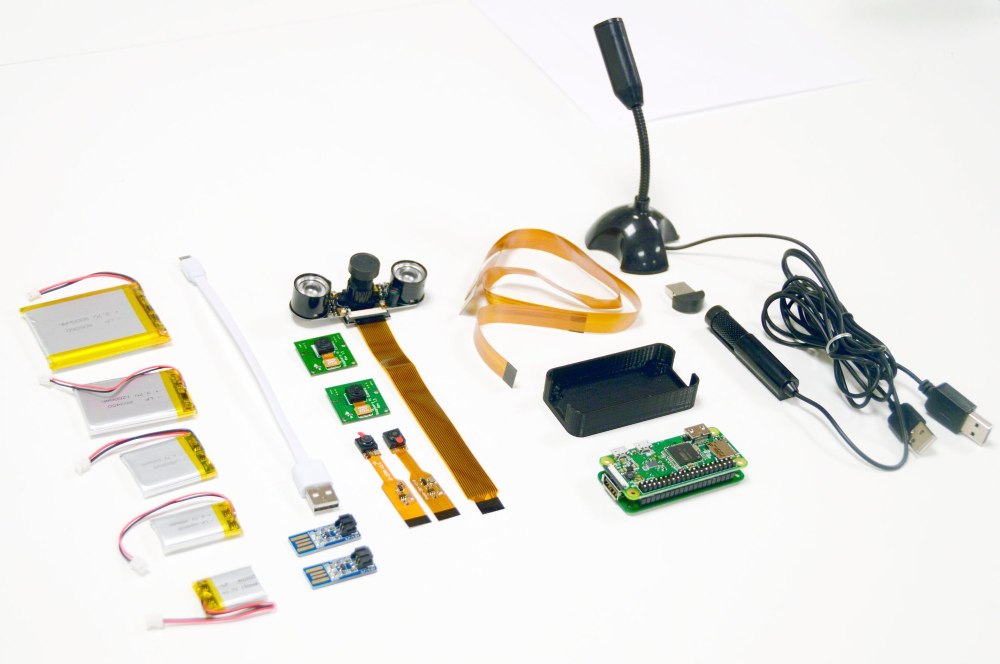

FROLIC studio collaborated with an undisclosed international NGO to develop a Modular Covert Camera, empowering human rights activists to document abuses. In the project's second phase, my role involved Raspberry Pi integration, performance optimization, and crafting a user-friendly web interface for mobile accessibility on a local network.

The NGO equips activists with covert cameras to capture evidence of rights abuses. Our challenge was to address technological limitations while ensuring operator safety and confidence. Through research and user interviews, we designed a covert prototype with modular functionalities, integrating Raspberry Pi for enhanced performance. Field testing validated its impact, offering diverse modules catering to various situational contexts and enabling effective operation even for users with limited technical knowledge. Ongoing collaboration aims to refine the camera further, with potential positive impact on public awareness and human rights advocacy.
