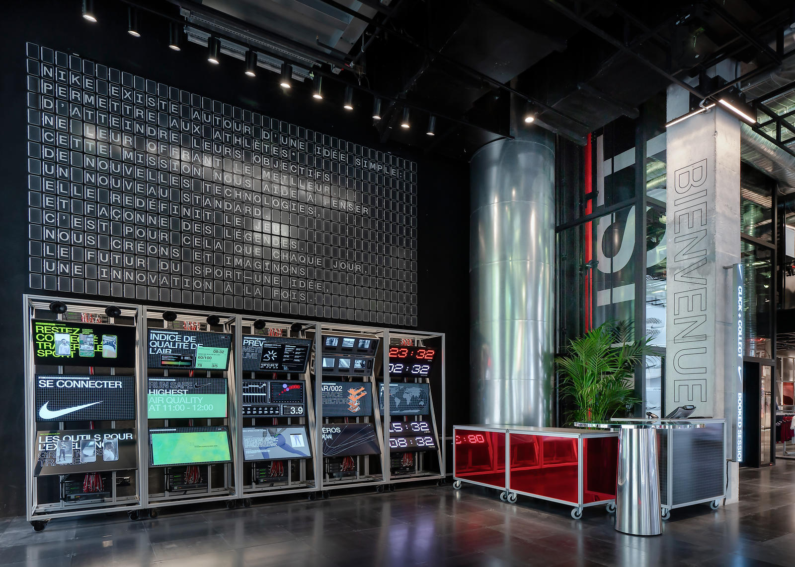

Nike's House of Innovation in Paris sought an innovative way to showcase their manifesto amidst an array of light-emitting screens. The solution arose in the form of the Manifesto Wall—a visually striking installation composed of 600 passive e-ink displays. This choice not only aligned with Nike's commitment to innovation but also provided a sustainable alternative to the existing screens, blending technology and ambiance seamlessly.

<video src="./nike.mp4" width="100%" autoplay muted loop playsinline preload="metadata"> </video>
*Testing different transitions during development*

The Manifesto Wall featured 50 Raspberry Pi-controlled modules overseeing 600 e-ink displays. The main challenges involved synchronizing the Pi's and integrating novel screen technology, utilized in a unique manner with minimal documentation. Additionally, I focused on providing a user-friendly interface for content management, empowering Nike designers to curate dynamic content seamlessly.

<iframe width="100%" height="285" src="https://www.youtube.com/embed/ukY87woyPNE" frameborder="0" allow="accelerometer; autoplay; clipboard-write; encrypted-media; gyroscope; picture-in-picture; web-share" allowfullscreen></iframe>
