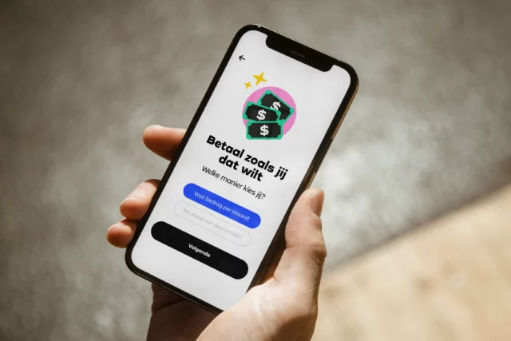

Seev is a practical app made to assist young individuals in managing bill payments effectively, speaking their language and addressing their unique experiences. Developed in collaboration with Stichting Enver, Seev stimulates responsible bill payments by encouraging both organizations and young users to play an active role in the payment process.

<iframe src="https://player.vimeo.com/video/631859471?h=c5bdcc9ee8&amp;title=0" width="1920" height="1080" frameborder="0" allow="autoplay; fullscreen; picture-in-picture" allowfullscreen class="video_embed"></iframe>

Seev offers a fresh approach to financial management, benefiting users and organizations alike. With personalized plans and reminders, users gain control responsibly. Promoting shared responsibility, Seev integrates online support and user-friendly features. Recognized with a Dutch Design Award, it aims to keep young individuals debt-free through dialogue and initiatives.

[Thijs Koerselman](https://www.vauxlab.com/) and I developed the back-end and hybrid app using React Native and Firebase. Collaborating closely with designers and stakeholders, I tackled challenges head-on, particularly the integration with the administrative department of the school during the pilot phase. This collaboration ensured that Seev met their specific needs while maintaining its user-friendly interface. My responsibilities included designing and implementing backend systems, ensuring seamless integration with the frontend, and addressing any technical hurdles that arose. Through these efforts, Seev was able to provide a secure and efficient platform for users to manage their finances responsibly.
