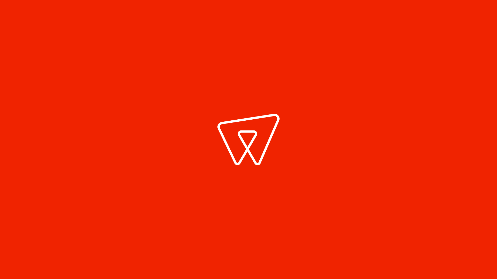

I'm currently working at wearereasonablepeople as a creative developer. Part concept work, part full-stack development. I join need-finding sessions, interview stakeholders, and help shape solutions before building them. I also maintain and extend production applications, some of which have been running for years.

Most client work is under NDA: insights dashboards, planning and invoice automation, a digital identity wallet, and other long-running applications. The one public case study is [Peter Plan](https://www.wearereasonablepeople.com/work/peter-plan), an AI assistant for workforce planners at Peterson, where I was involved from interviews through execution.

Lately, much of my focus is on transitioning the agency to an agent-centric workflow; experimenting with how designers and developers collaborate, with a spec-driven development process at the center.

